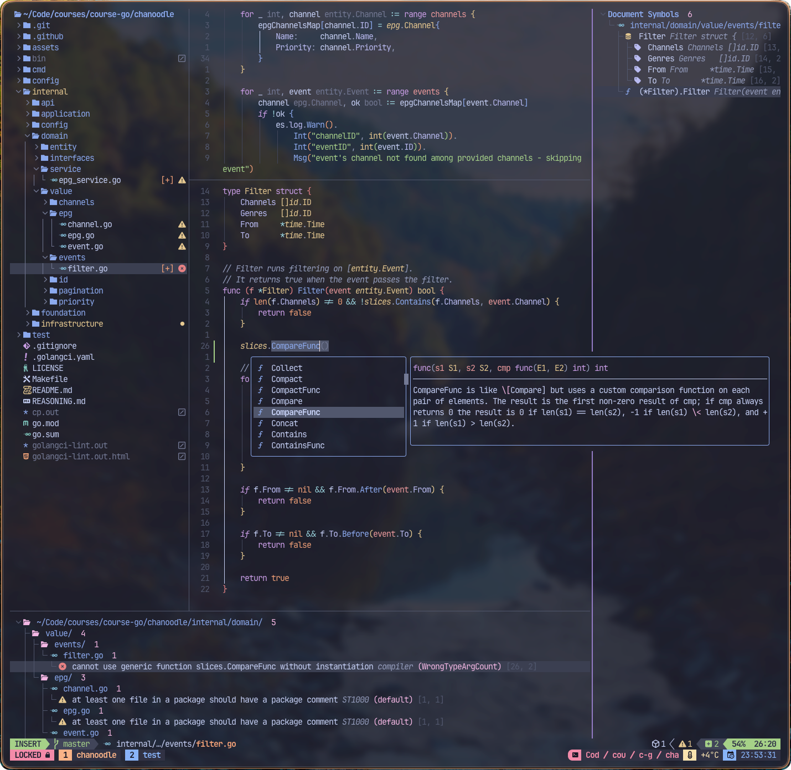

# Custom LazyVim configuration

This repository contains my personal configuration for [LazyVim](https://github.com/LazyVim/LazyVim).

_Created using the [LazyVim starter template](https://github.com/LazyVim/starter)._

## Showcase

